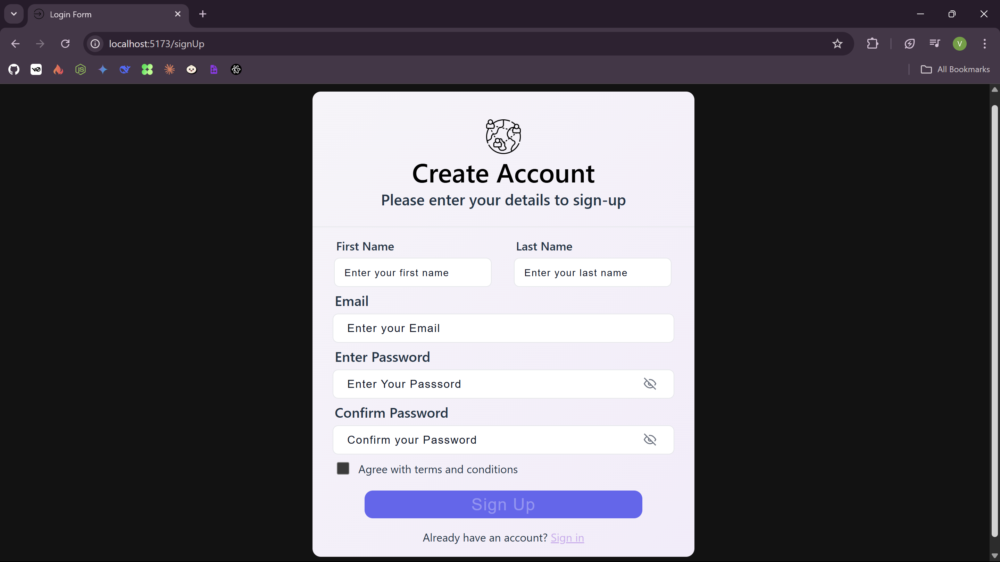
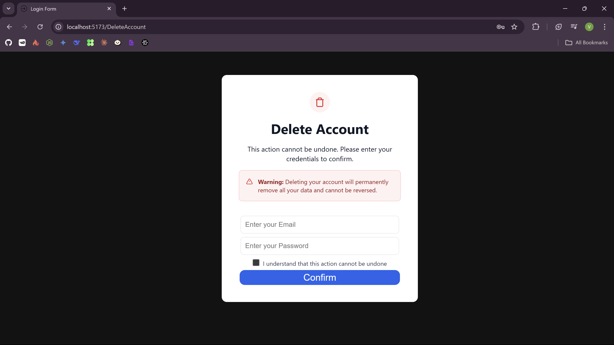

# 🔐 Login Form (React + Node)

A simple login form built using React and JSX, featuring field validation, error messaging, disabled button states, and persistent data storage via localStorage.

## Features
 - 🛂 All input fields are validated 
 - ❗ Displays error messages under each invalid input
 - 🔒 Submit button is disabled until all fields are valid
 - 💾 localStorage is used to persist user input even on refresh
 - 📂 Data is stored in a JSON file for easy access(then will be hashed)

 * 🧪 Validation Logic
    - Email: Must be a valid email format
    - Password: Minimum 6 characters
    - Fields show errors after blur or invalid submission
    - Form can't be submitted until all fields are valid
## Technologies Used
- React.js
- Node.js
- CSS for styling
- JSON for DB
- Vite for development server
- npm for package management

### 📂 File Structure
```
backend/
├── server.js
|── data
|    ├── users.json
src/
|── assets/                     
├── components/            
│   ├── LoginForm.jsx
│   ├── SignUp.jsx  
│   ├── DeleteAccount.jsx
│   ├── ValidationMessage.jsx
│   ├── SuccesfullLogin.jsx
│   ├── SuccesfullSignUp.jsx
│   └── SuccesfullLogout.jsx
├── App.jsx
├── main.jsx
├── index.css
├── index.html
├── vite.config.js
├── package.json
├── package-lock.json
└── README.md
```

### 🛠️ Installation

- git clone https://github.com/OV111/Login_Form_JSX.git
- cd login-form-react
- npm install
- npm run dev






### 📄 License
This project is licensed under the MIT License - see the [LICENSE](./LICENSE) file for details.
