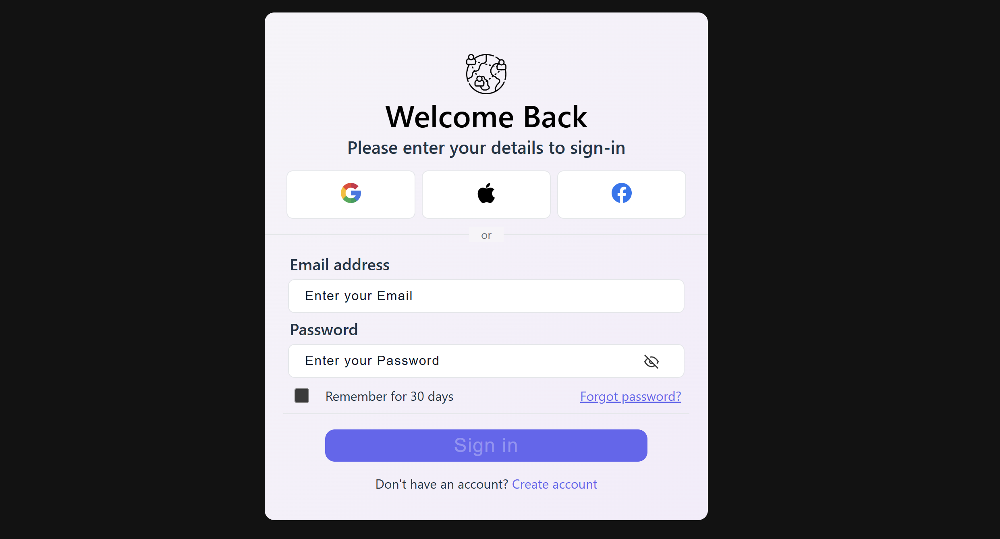

# 🔐 Login Form (React)

A simple login form built using React and JSX, featuring field validation, error messaging, disabled button states, and persistent data storage via localStorage.

## Features
 - 🛂 All input fields are validated 
 - ❗ Displays error messages under each invalid input
 - 🔒 Submit button is disabled until all fields are valid
 - 💾 localStorage is used to persist user input even on refresh

 * 🧪 Validation Logic
    - Email: Must be a valid email format
    - Password: Minimum 6 characters
    - Fields show errors after blur or invalid submission
    - Form can't be submitted until all fields are valid

### 🛠️ Installation

- git clone https://github.com/OV111/Login_Form_JSX.git
- cd login-form-react
- npm install
- npm run dev

